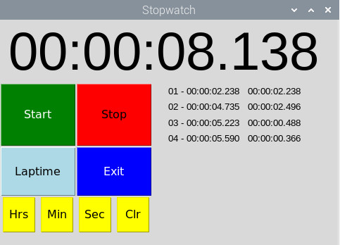
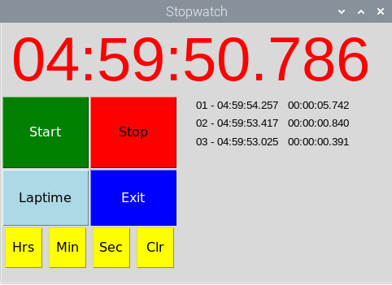

# Pi-Stopwatch-Timer

Designed to be used with a Pi and a LCD, but will work on other monitors. Should autosize to screen size

Use onscreen buttons or buttons attached to GPIO.

Can be used as a Stopwatch or Countdown timer.

For Stopwatch click on Start. Stop to stop the stopwatch, Stop again to clear. Laptime to show laptimes.

For Countdown timer set required time with Hrs/Mins/Secs, then click on Start.Stop to stop the timer, Stop again to clear. Laptime to show laptimes.

## Stopwatch Screenshot

## Coundown Timer Screenshot

